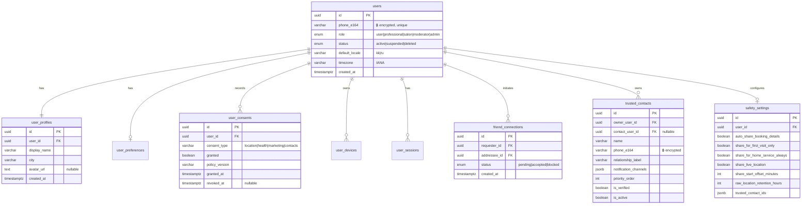
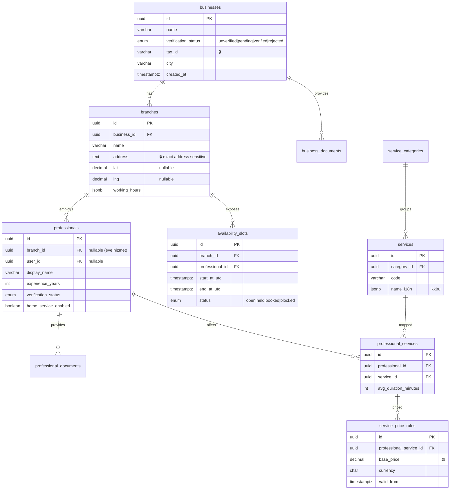
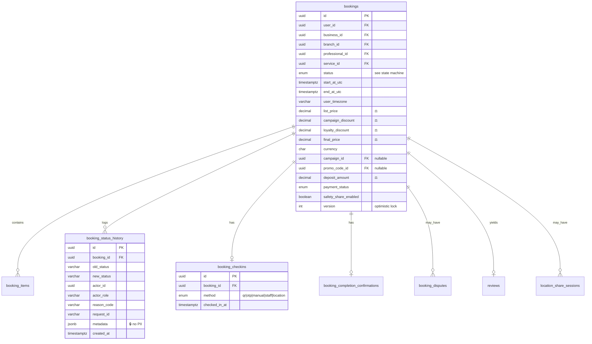
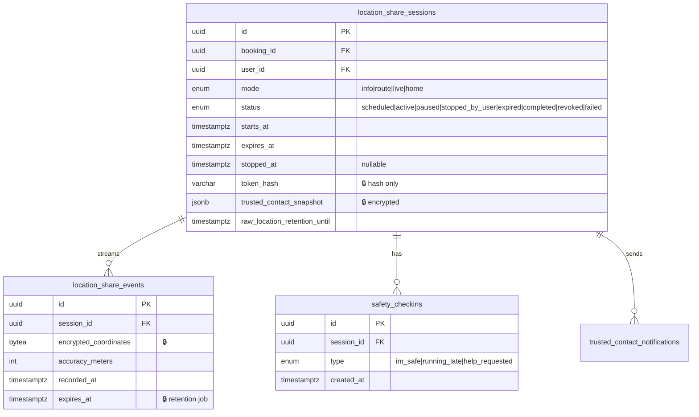
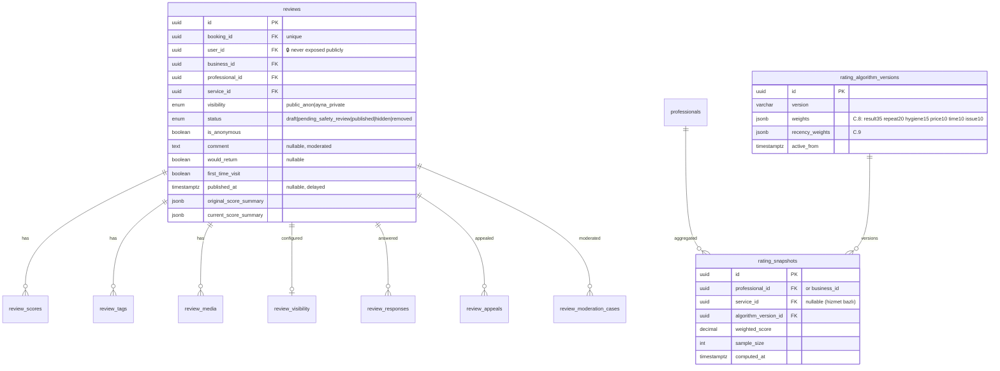
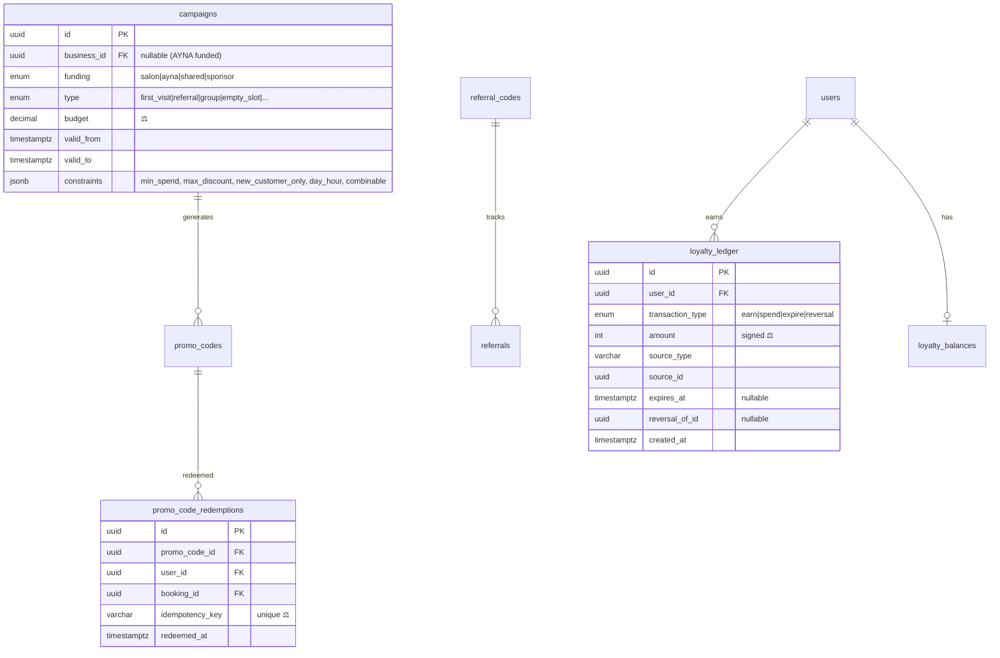

# AYNA — ERD Taslağı (v0.1)

> EK M madde 4. EK E veri modelinin ilişkisel taslağı. Bağlayıcı değil; Prisma şemasına dönüştürülmeden önce gözden geçirilir. Tüm tarihler `timestamptz` (UTC). Hassas alanlar 🔒, finans alanları ⚖️.

## 1. Genel kurallar

- PK: `id uuid` (default `gen_random_uuid()`).
- Tüm tablolar `created_at`, `updated_at`.
- Soft-delete sadece gerekli yerlerde (`deleted_at`); hassas veride **hard delete + crypto-shredding**.
- Para: `NUMERIC(12,2)`, `currency CHAR(3)` default `KZT`. ⚖️
- Enum'lar Postgres native enum veya `varchar + check`.
- FK'ler `ON DELETE` davranışı açıkça tanımlı (çoğu `RESTRICT`; kullanıcı silmede PII haritası job'u).

## 2. Kimlik & Profil



## 3. İşletme & Hizmet



## 4. Randevu (çekirdek)



> Unique constraint önerisi (R3): `availability_slots(professional_id, start_at_utc)` ve onaylı randevuda slot kilidi → çift rezervasyon engeli. 🧩

## 5. Güvenlik (AYNA Safe)



> `location_share_events` ayrı + kısa ömürlü + retention job ile silinir. Koordinat **asla** log/analytics'e. → [security/02](../security/02-ayna-safe-privacy-threat-model.md)

## 6. Değerlendirme



> Kritik: `reviews.user_id` hiçbir public/işletme response'unda dönmez. Hizmet bazlı puan ayrı snapshot. → [security/01](../security/01-anonymous-review-threat-model.md)

## 7. Kampanya & Sadakat ⚖️



> `loyalty_balances` sadece **türetilmiş/cache**; doğruluk kaynağı `loyalty_ledger` toplamıdır. ⚖️ (Risk R5)

## 8. Topluluk, Kişisel Yaşam, İçerik, Sistem (özet)

EK E.7–E.9 tabloları aynı prensiplerle modellenir:

- **Circle:** `circles`, `circle_members`, `posts`, `post_categories`, `post_visibility`, `post_reports`, `recommendations`, `recommendation_evidence`, `comments`.
- **Kişisel yaşam (Faz 3, 🔒):** `cycle_entries`, `mood_entries`, `vault_items` — varsayılan kapalı, ayrı şifreleme, reklam/analytics yasak, kullanıcı silebilir. `beauty_passports` + entries, `care_schedules`, `moments`, `ready_plans`, `budgets`.
- **İçerik:** `content_articles`, `content_categories`, `content_translations`, `expert_profiles`, `content_sources`, `content_bookmarks`.
- **Sistem:** `notifications`, `notification_preferences`, `moderation_cases`, `audit_logs`, `feature_flags`, `system_settings`.

### audit_logs (🔒 EK H.5)

```text
id, actor_id, actor_role, action, resource_type, resource_id,
request_id, timestamp, ip_hash, device_hash, safe_diff (🔒 no sensitive data)
```

## 9. Açık ERD soruları

1. `professionals.user_id` nullable mı? (Uzmanın AYNA hesabı olmadan salon tarafından eklenmesi senaryosu) → **Evet, nullable.**
2. Hizmet bazlı puan `rating_snapshots`'ta `service_id` ile mi, ayrı tablo mu? → Aynı tablo, `service_id` nullable (null = genel puan).
3. Şifreleme: alan-bazlı (pgcrypto) mı, uygulama-katmanı mı? → Telefon/koordinat **uygulama katmanı** (anahtar yönetimi KMS); → [security/03](../security/03-data-classification.md).
