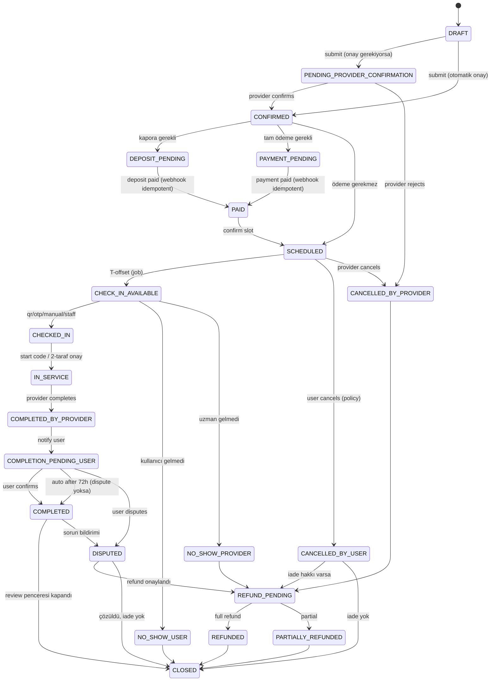

# AYNA — Randevu State Machine

> EK M madde 5. EK A'nın uygulanabilir durum makinesi. Geçersiz geçişler backend tarafından **reddedilir** (EK A.6). Her geçiş `booking_status_history` + `audit_logs` üretir.

## 1. Durumlar

```text
DRAFT
PENDING_PROVIDER_CONFIRMATION
CONFIRMED
DEPOSIT_PENDING
PAYMENT_PENDING
PAID
SCHEDULED
CHECK_IN_AVAILABLE
CHECKED_IN
IN_SERVICE
COMPLETED_BY_PROVIDER
COMPLETION_PENDING_USER
COMPLETED
CANCELLED_BY_USER
CANCELLED_BY_PROVIDER
NO_SHOW_USER
NO_SHOW_PROVIDER
DISPUTED
REFUND_PENDING
PARTIALLY_REFUNDED
REFUNDED
CLOSED
```

## 2. Ana akış diyagramı



## 3. Geçiş kuralları (bağlayıcı)

| Geçiş | Önkoşul / Kural |
|-------|-----------------|
| `DRAFT → *` | Sadece sahibi görür; rezervasyon sayılmaz. |
| `→ CONFIRMED` | Slot iki tarafta ayrılır (slot lock 🧩). |
| `→ DEPOSIT/PAYMENT_PENDING` | İptal politikası **ödemeden önce** kullanıcıya gösterilir. |
| `→ PAID` | Ödeme webhook **idempotent**; aynı event iki kez = tek ödeme (R4). |
| `→ CHECK_IN_AVAILABLE` | Randevudan yapılandırılabilir süre önce (job). |
| `→ CHECKED_IN` | QR / 6-haneli OTP / "Geldim" / personel / opsiyonel konum. Konum **asla zorunlu değil**. |
| `→ IN_SERVICE` | Başlangıç kodu veya iki taraf onayı veya salon paneli. |
| `→ COMPLETED` (auto) | `COMPLETION_PENDING_USER`'da 72s (konfigüre, EK7) + açık dispute yoksa. |
| `COMPLETED` | Değerlendirme hakkı **burada** açılır (EK C.2). Daha önce kamuya yorum **yok** (EK A.6). |
| Fiyat değişimi | **Her** fiyat artışı kullanıcı onayı gerektirir; onaysız tutar artırılamaz. |
| Çakışma | Kullanıcı ve uzman aynı slotta iki onaylı randevu alamaz. 🧩 |

## 4. Terminal durumlar

`CLOSED`, `REFUNDED`, `PARTIALLY_REFUNDED` (→CLOSED), `NO_SHOW_USER` (→CLOSED) terminal kabul edilir. Terminal durumdan çıkış yoktur (yeni randevu = yeni kayıt).

## 5. Geçiş tablosu (uygulama referansı)

Domain katmanında (`packages/domain/booking`) açık bir **izin verilen geçişler haritası** tutulur:

```ts
const ALLOWED: Record<BookingStatus, BookingStatus[]> = {
  DRAFT: ['PENDING_PROVIDER_CONFIRMATION', 'CONFIRMED', 'CANCELLED_BY_USER'],
  PENDING_PROVIDER_CONFIRMATION: ['CONFIRMED', 'CANCELLED_BY_PROVIDER', 'CANCELLED_BY_USER'],
  CONFIRMED: ['DEPOSIT_PENDING', 'PAYMENT_PENDING', 'SCHEDULED', 'CANCELLED_BY_USER', 'CANCELLED_BY_PROVIDER'],
  DEPOSIT_PENDING: ['PAID', 'CANCELLED_BY_USER', 'CANCELLED_BY_PROVIDER'],
  PAYMENT_PENDING: ['PAID', 'CANCELLED_BY_USER', 'CANCELLED_BY_PROVIDER'],
  PAID: ['SCHEDULED', 'REFUND_PENDING'],
  SCHEDULED: ['CHECK_IN_AVAILABLE', 'CANCELLED_BY_USER', 'CANCELLED_BY_PROVIDER'],
  CHECK_IN_AVAILABLE: ['CHECKED_IN', 'NO_SHOW_USER', 'NO_SHOW_PROVIDER', 'CANCELLED_BY_USER', 'CANCELLED_BY_PROVIDER'],
  CHECKED_IN: ['IN_SERVICE', 'CANCELLED_BY_PROVIDER'],
  IN_SERVICE: ['COMPLETED_BY_PROVIDER'],
  COMPLETED_BY_PROVIDER: ['COMPLETION_PENDING_USER'],
  COMPLETION_PENDING_USER: ['COMPLETED', 'DISPUTED'],
  COMPLETED: ['DISPUTED', 'CLOSED'],
  CANCELLED_BY_USER: ['REFUND_PENDING', 'CLOSED'],
  CANCELLED_BY_PROVIDER: ['REFUND_PENDING', 'CLOSED'],
  NO_SHOW_USER: ['CLOSED'],
  NO_SHOW_PROVIDER: ['REFUND_PENDING', 'CLOSED'],
  DISPUTED: ['REFUND_PENDING', 'CLOSED'],
  REFUND_PENDING: ['REFUNDED', 'PARTIALLY_REFUNDED'],
  PARTIALLY_REFUNDED: ['CLOSED'],
  REFUNDED: ['CLOSED'],
  CLOSED: [],
};
```

Geçiş fonksiyonu `transition(current, next, actor)`:
1. `next ∈ ALLOWED[current]` değilse → `InvalidTransitionError` (HTTP 409).
2. Aktör yetkisi kontrol (örn. `complete-provider` sadece uzman/salon).
3. Yan etkiler event'e (job kuyruğu) → retry-safe.
4. `booking_status_history` + `audit_logs` yazılır (atomik, aynı transaction).

## 6. Acceptance Criteria (EK A.6)

- [ ] Geçersiz durum geçişleri backend tarafından reddedilir (409).
- [ ] Aynı ödeme webhook'u iki kez gelse bile randevu iki kez ödenmiş sayılmaz.
- [ ] Kullanıcı ve uzman aynı slotta çakışan iki onaylı randevu alamaz.
- [ ] İptal politikası kullanıcıya ödeme öncesi gösterilir.
- [ ] Tüm fiyat değişiklikleri kullanıcı onayı gerektirir.
- [ ] Kullanıcı onayı olmadan tutar artırılamaz.
- [ ] Randevu `COMPLETED` olmadan kamuya açık yorum bırakılamaz.
