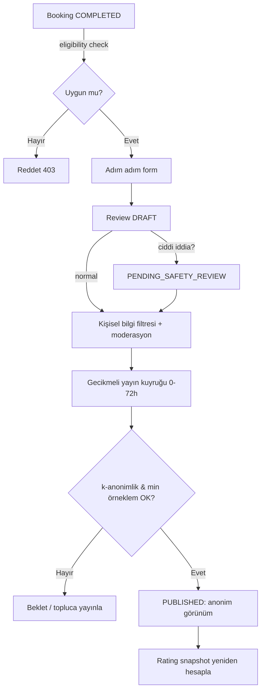

# AYNA — Anonim Yorum Sistemi: Veri Akışı & Threat Model

> EK M madde 6. Temel prensip (EK C.1): **Kullanıcı kamuya ve işletmeye karşı anonim, AYNA'ya karşı doğrulanmış ve sorumludur.**

## 1. Güven sınırları & aktörler

| Aktör                       | Kullanıcı kimliğini görebilir mi? | Notlar                                        |
| --------------------------- | --------------------------------- | --------------------------------------------- |
| Diğer kullanıcılar (public) | ❌ Asla                           | "Doğrulanmış AYNA üyesi" görür                |
| İşletme / uzman             | ❌ Asla                           | Yoruma cevap verebilir, kimlik göremez        |
| Moderatör                   | ⚠️ Sınırlı                        | Sadece moderasyon vakası bağlamında, audit'li |
| AYNA sistemi (DB)           | ✅                                | `reviews.user_id` saklanır ama korunur        |
| Saldırgan (dış)             | ❌ Hedef                          | Tüm vektörler kapatılmalı                     |

## 2. Veri akışı

**Anonim görünümde gösterilen (EK C.5):** "Doğrulanmış AYNA üyesi", hizmet kategorisi, yaklaşık dönem ("son 30 gün içinde"), ilk/tekrar ziyaret, puan, moderasyondan geçmiş metin, izinli medya.

**Asla gösterilmeyen:** ad, telefon, profil foto, tam tarih/saat, randevu numarası, kimliği açığa çıkaran metadata.

## 3. STRIDE analizi

| Tehdit              | Senaryo                              | Önlem                                                                                |
| ------------------- | ------------------------------------ | ------------------------------------------------------------------------------------ |
| **S**poofing        | Hizmet almayan biri yorum yazar      | Eligibility: sadece `COMPLETED` + randevu sahibi + doğrulanmış hizmet kaydı (EK C.2) |
| **T**ampering       | Kullanıcı puanı/işletmeyi değiştirir | Yorum booking'e bağlı (unique), business/professional booking'den türetilir          |
| **R**epudiation     | "Bu yorumu ben yazmadım"             | Audit log (actor + request_id), ama public'te anonim                                 |
| **I**nfo disclosure | **Deanonymization** (en kritik)      | Bölüm 4                                                                              |
| **D**oS             | Review bombing / organize saldırı    | Bölüm 5                                                                              |
| **E**levation       | İşletme API'den user_id çeker        | `user_id` hiçbir public/pro response DTO'sunda yok; response şeması whitelist        |

## 4. Deanonymization vektörleri (🔴 en kritik risk R1)

| #   | Vektör                                                          | Önlem                                                                         |
| --- | --------------------------------------------------------------- | ----------------------------------------------------------------------------- |
| D1  | **Zaman korelasyonu**: işletme yorumu kendi takvimiyle eşler    | Gecikmeli yayın (0–72s rastgele); tam tarih/saat gizli; "son 30 gün" aralığı  |
| D2  | **Küçük örneklem**: salonda tek müşteri = tek yorumcu           | k-anonimlik k≥5: yorum sayısı eşiğe ulaşana dek **toplu** yayın (EK C.6)      |
| D3  | **Alt kategori spesifikliği**: nadir hizmet ifşa eder           | Kimlik riski varsa alt→üst kategori genelleştirme                             |
| D4  | **Metin parmak izi**: yazım tarzı/detay                         | Moderasyon; kullanıcıya "kişisel detay verme" uyarısı; kişisel bilgi filtresi |
| D5  | **Medya EXIF/yüz**: foto metadata                               | EXIF temizleme, yüz/3. kişi moderasyonu (EK H.4)                              |
| D6  | **İşletme cevabı sızıntısı**: işletme cevapta detay yazıp eşler | Cevapta kişisel bilgi yasak; moderasyon                                       |
| D7  | **API enumeration**: review ID'lerden user çıkarımı             | Response'ta user_id yok; review id ↔ booking id ilişkisi public değil         |
| D8  | **Tek yorumlu işletme + özel bildirim** (Ç3)                    | Özel bildirim işletmeye sadece k≥5 toplulaştırılmış tema olarak               |

## 5. Sahte yorum / abuse (EK C.14)

Sinyaller: aynı cihazdan çok hesap, aynı ödeme aracı, aynı IP pattern, kopya metin, kısa sürede tek işletmeye saldırı, çalışanın kendi işletmesine yorum, rakip bağlantısı, tamamlanmamış randevu.

Önlem:

- Şüpheli yorum **puana hemen katılmaz** (karantina).
- Cihaz/IP/ödeme korelasyon skoru.
- Rate limit (kullanıcı başına aktif itiraz/yorum).
- Organize saldırı tespitinde toplu inceleme.

## 6. Puanlama bütünlüğü (⚖️)

- Salon ve uzman puanı **ayrı** hesaplanır.
- Hizmet bazlı puan ayrı (min 5 doğrulanmış işlem).
- Ağırlık algoritması **versiyonlu** (`rating_algorithm_versions`); snapshot üretilir; geçmiş yeniden hesaplanabilir.
- **Admin tek bir kullanıcının puanını manuel veremez.**
- Ödül, yorumun **olumlu** olmasına değil **doğrulanmış** olmasına bağlıdır (EK 9.9, C.15).

## 7. Acceptance Criteria (EK C.15)

- [ ] Tamamlanmamış randevu değerlendirilemez.
- [ ] Aynı randevu için tek nihai yorum.
- [ ] İşletme anonim user_id'yi API'den çıkaramaz.
- [ ] Uzman ve salon puanı ayrı.
- [ ] Hizmet bazlı puan ayrı.
- [ ] Ciddi sağlık iddiası otomatik yayımlanmaz (`PENDING_SAFETY_REVIEW`).
- [ ] Kişisel bilgi filtresi uygulanır.
- [ ] İşletme itirazı audit log üretir.
- [ ] Kullanıcı olumlu puana teşvik edilmez.
- [ ] k-anonimlik eşiği uygulanır (k≥5).
- [ ] Yayın gecikmesi + tarih genelleştirme aktif.
