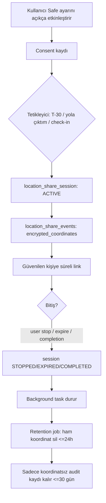

# AYNA Safe — Konum Paylaşımı Privacy Threat Model

> EK M madde 7. Temel kural (EK B.2): **"Otomatik paylaşım", kullanıcının daha önce açıkça etkinleştirdiği otomasyondur. Varsayılan gizli ve kapalıdır.** Bu özellik resmî acil yardım servisi değildir.

## 1. Güven sınırları

| Aktör               | Erişim                                                                  |
| ------------------- | ----------------------------------------------------------------------- |
| Kullanıcı           | Tam kontrol; tek dokunuşla durdurur                                     |
| Güvenilen kişi      | Sadece paylaşılan randevu bilgisi/konum; başka özel veri **yok**        |
| Salon / uzman       | Güvenilen kişileri **göremez**; paylaşımdan habersiz                    |
| AYNA sistemi        | Şifreli koordinat (kısa ömürlü); ham koordinat log/analytics'e **asla** |
| Link sahibi (token) | Süreli, iptal edilebilir, minimum veri                                  |
| Saldırgan           | Tüm vektörler hedef                                                     |

## 2. Konum verisi yaşam döngüsü

## 3. STRIDE + gizlilik tehditleri

| Tehdit                       | Senaryo                                     | Önlem                                                                                                       |
| ---------------------------- | ------------------------------------------- | ----------------------------------------------------------------------------------------------------------- |
| **Info disclosure**          | Ham konum log/analytics/backup'a sızar (R2) | Koordinat şifreli + ayrı kısa ömürlü tablo; log filtre middleware; analytics'e asla; backup'tan hariç (R14) |
| **Spoofing**                 | Sahte güvenilen kişi linki ele geçirir      | Token ≥128 bit, hash saklama, kısa TTL, iptal, 410 Gone, no-index                                           |
| **Tampering**                | Link parametre manipülasyonu                | Token opak; sunucu tarafı yetki; IDOR koruması                                                              |
| **Repudiation**              | Paylaşım başlangıç/bitiş izi yok            | Audit log (koordinatsız): start/stop                                                                        |
| **DoS**                      | Share link brute force (R8)                 | Rate limit, uzun token, kısa TTL                                                                            |
| **Elevation**                | Salon güvenilen kişi listesine erişir       | Endpoint RBAC; salon rolü trusted-contacts'a **erişemez**                                                   |
| **Consent ihlali**           | Rıza geri çekilince paylaşım sürer          | Revoke → aktif oturum **anında** durur                                                                      |
| **Aşırı tahminlenebilirlik** | Adres link üzerinden gereksiz ifşa          | Eve hizmette açık adres link'te gösterilmez (B.5.4)                                                         |

## 4. Zorunlu gizlilik kuralları (EK B.2)

- Açık onay olmadan canlı konum **başlamaz**.
- Kullanıcı paylaşım öncesi **kim/ne/ne kadar** süre görür.
- Her randevuda paylaşımı kapatabilir; tek dokunuşla durdurabilir.
- Salon/uzman güvenilen kişileri göremez.
- Güvenilen kişi başka özel veri göremez.
- Ham konum analytics/pazarlamaya **gitmez**.

## 5. Güvenli paylaşım linki (EK B.8)

- Uzun, tahmin edilemez token; DB'de yalnızca **hash**.
- Süreli; kullanıcı anında iptal eder.
- `noindex` (arama motoru kapalı).
- Hassas veri **cache edilmez** (`Cache-Control: no-store`).
- Link ekranında telefon/tam profil yok.
- Süresi dolmuş token → **410 Gone**.

## 6. Veri saklama (EK B.10)

| Veri                        | Varsayılan retention          | Konfigüre     |
| --------------------------- | ----------------------------- | ------------- |
| Ham koordinat               | Oturum bitişi + 24s sonra sil | 1s / 6s / 24s |
| Koordinatsız güvenlik audit | 30 gün                        | —             |
| Geçmiş paylaşım kaydı       | Kullanıcı silebilir           | —             |

Yasal zorunluluk yoksa ham konum **backup'ta uzun süre kalmamalı** → crypto-shredding değerlendir.

## 7. Background location (EK B.11)

- Yalnızca **aktif** paylaşım oturumunda çalışır.
- Kalıcı takip izni **istenmez**.
- OS izinleri bağlamsal açıklanır.
- Adaptive update interval (pil).
- Paylaşım bitince background task **durur**.

## 8. Konum izni yoksa (EK B.12) — graceful degrade

Statik salon adresi + randevu durumu + check-in bilgisi paylaşılır. Kullanıcı konuma **zorlanmaz**.

## 9. "Yardım istiyorum" (EK B.9)

- Güvenilen kişiye yüksek öncelikli bildirim.
- Kullanıcıya arama seçenekleri + yerel acil numara hızlı erişimi.
- **Otomatik olarak resmî makama olay göndermez.**

## 10. Acceptance Criteria (EK B.13)

- [ ] Varsayılan konum paylaşımı kapalı.
- [ ] Açık rıza kaydedilir.
- [ ] Rıza geri çekilince aktif paylaşım durur.
- [ ] Güvenilen kişi linki süre sonunda çalışmaz (410).
- [ ] Salon güvenilen kişi listesini göremez.
- [ ] Ham koordinat loglara yazılmaz.
- [ ] Oturum kapanınca background tracking durur.
- [ ] Retention job ham koordinatı süresinde siler.
- [ ] Link iptalinde erişim anında kapanır.
- [ ] Kullanıcı aktif paylaşımı uygulamada açıkça görür.
